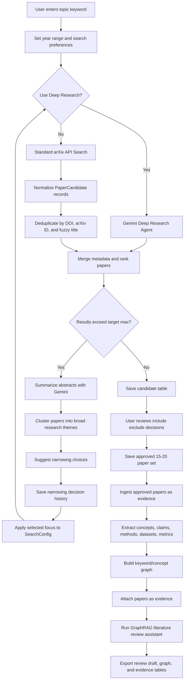
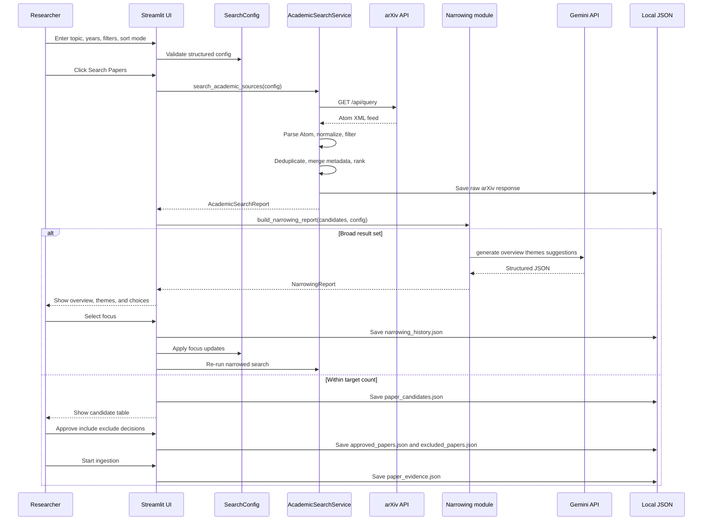

# LiteratureWikiGraphRAG

An LLM Wiki-style GraphRAG project for literature review. Instead of treating each paper as a graph node, the system builds a sparse concept graph where each node is a keyword, concept, method, dataset, metric, limitation, or research direction. Papers are stored as evidence attached to concept nodes and edges.

# LiteratureWikiGraphRAG

An LLM Wiki-style GraphRAG project for literature review. Instead of treating each paper as a graph node, the system builds a sparse concept graph where each node is a keyword, concept, method, dataset, metric, limitation, or research direction. Papers are stored as evidence attached to concept nodes and edges.

This README is the project tracker. Future sessions should update the checkboxes as features are built, tested, and documented.

## Product Goal

Help a researcher start from a broad topic, narrow the search space to a high-quality set of about 15-20 papers, then build a concept-centric GraphRAG workspace that can generate literature review summaries, research gap analysis, reading plans, and review outlines with citations.

## Core User Flow



## Current Flow Gaps To Fix Next

The project currently has a working search, narrowing, and ingestion scaffold. The priority logic gaps to address are:

- `min_citation_count` keeps candidates with unknown citation counts, which should be made
  explicit in the UI or configurable.
- LLM narrowing suggestions append `must_include_keywords` as strict AND filters, which can
  over-narrow searches without a preview step.
- The current embedding field uses a deterministic placeholder hash, not a semantic
  embedding. It should be renamed or disabled until real embeddings are wired in.

## Repair Plan

### Phase 1: Candidate Approval Gate

- [x] Split runtime artifacts into:
  - `paper_candidates.json` for the latest normalized search results.
  - `approved_papers.json` for the researcher-approved final paper set.
  - `excluded_papers.json` for rejected candidates and exclusion reasons.
  - `paper_evidence.json` for ingestion output.
- [x] Prevent ingestion while the result set is still above `target_max_papers`.
- [x] Add a final review table with include/exclude controls once the narrowed result set is
  within target range.
- [x] Save approved papers only after explicit user confirmation.
- [x] Change ingestion to read from `approved_papers.json` instead of `paper_candidates.json`.
- [x] Add tests that broad search results cannot be ingested before approval.

### Phase 2: Search Sources And Filter Semantics

- [x] Integrate Gemini Deep Research via the Interactions API (`deep-research-preview-04-2026`).
- [x] Stream research progress reasoning/thoughts in real-time to Streamlit using `st.status`.
- [x] Display synthesized markdown research report with citations.
- [x] Graceful fallback to arXiv API on failure or missing API key.
- [x] Add unit tests for Deep Research parsing, prompt generation, and configuration.
- [ ] Add source selection in the Streamlit sidebar for arXiv, OpenAlex, and Semantic Scholar (standard search fallback).
- [ ] Update `build_default_search_service` so enabled connectors come from UI/config instead
  of being hardcoded to arXiv only.
- [ ] Clarify citation filtering behavior for unknown citation counts:
  - keep unknown counts but label them clearly; or
  - add a strict mode that excludes unknown counts.
- [ ] Make open-access filtering source-aware by using `open_access`, `pdf_url`, and source
  metadata consistently.
- [ ] Update ranking explanations to call out when citation data is missing.

### Phase 3: Narrowing Preview And History

- [ ] Add a preview step before applying LLM narrowing suggestions.
- [ ] Show a config diff for proposed updates before rerunning search.
- [ ] Support softer keyword filtering, such as `must_include_any` and `must_include_all`,
  instead of one strict `must_include_keywords` list.
- [ ] Store richer narrowing history:
  - user message;
  - config before;
  - config after;
  - result count before;
  - result count after;
  - applied suggestion.
- [ ] Reset narrowing chat/history when a new topic search starts.

### Phase 4: GraphRAG-Ready Ingestion

- [ ] Rename `hash_embedding` to `placeholder_embedding` or disable embedding generation by
  default until real semantic embeddings are available.
- [ ] Add a concept extraction stage that reads `paper_evidence.json` and writes
  `concept_candidates.json`.
- [ ] Build `concept_graph.json` from approved evidence, keeping papers as evidence rather
  than primary graph nodes.
- [ ] Add retrieval only after concept graph artifacts exist.

## Feature Build Tracker

### 0. Project Setup

- [x] Create project folder.
- [x] Create this README tracker.
- [x] Choose final app stack.
- [x] Create `.env.example`.
- [x] Create `requirements.txt` or `pyproject.toml`.
- [x] Add basic `.gitignore`.
- [x] Add sample data folder.
- [x] Add first runnable app entrypoint.

Recommended stack:

- Python.
- Streamlit for the first UI.
- FastAPI-ready backend modules, but do not overbuild the API layer at MVP stage.
- Google Gemini API through the official Google GenAI SDK.
- arXiv API for paper discovery in the current MVP stage.
- OpenAlex and Semantic Scholar are deferred until the ranking/deduplication stage needs
  broader metadata coverage.
- Local JSON for graph metadata at MVP stage.
- ChromaDB or LanceDB for vector search.
- NetworkX for concept graph operations.

Chosen MVP setup:

- Python package under `src/literature_wiki_graphrag`.
- Streamlit first UI at `src/literature_wiki_graphrag/app.py`.
- Pydantic schemas for structured search config and normalized paper candidates.
- Local JSON sample data under `data/samples`.
- Runtime settings loaded from `.env` with `.env.example` as the template.

Run locally:

```powershell
py -m venv .venv
.\.venv\Scripts\python.exe -m pip install -e ".[dev]"
.\.venv\Scripts\streamlit.exe run src\literature_wiki_graphrag\app.py
```

## MVP Stack Workflow

The current stack keeps the first milestone intentionally small: Streamlit owns the
researcher-facing workflow, backend modules stay plain Python and FastAPI-ready, and all
intermediate artifacts are saved as local JSON before the project graduates to vector search
and GraphRAG indexing.

```mermaid
flowchart LR
  User[Researcher] --> UI[Streamlit app.py]
  UI --> Config[SearchConfig Pydantic model]
  Config --> SearchService[AcademicSearchService]
  SearchService --> Arxiv[arXiv connector]
  Arxiv --> Atom[Atom XML response]
  Atom --> Normalize[Normalize to PaperCandidate]
  Normalize --> Dedupe[DOI arXiv fuzzy-title dedupe]
  Dedupe --> Merge[Merge metadata from duplicates]
  Merge --> Rank[Rank newest most-cited or balanced]
  Rank --> Broad{Count above target max?}
  Broad -- Yes --> Narrow[NarrowingReport]
  Narrow --> Gemini[Gemini API: overview themes suggestions]
  Narrow --> Heuristic[Heuristic fallback if API unavailable]
  Gemini --> Choices[Narrowing choices in Streamlit]
  Heuristic --> Choices
  Choices --> History[data outputs narrowing_history.json]
  Choices --> Config
  Broad -- No --> Table[Candidate table in Streamlit]
  Table --> Candidates[data outputs paper_candidates.json]
  Candidates --> Review[Include exclude review]
  Review --> Approved[data outputs approved_papers.json]
  Approved --> Ingestion[data outputs paper_evidence.json]
  Arxiv --> Raw[data raw arXiv response]
```





Runtime data flow:

- `SearchConfig` captures topic, year range, sort mode, target count, citation minimum,
  keyword include/exclude filters, paper type, and open-access preference.
- The sidebar also exposes a source result limit, currently 10-100 arXiv results per
  search before deduplication and ranking.
- `ArxivConnector` calls `https://export.arxiv.org/api/query` with `httpx`.
- The arXiv Atom XML response is parsed with Python's standard XML parser.
- Each source result is normalized into the shared `PaperCandidate` schema.
- `AcademicSearchService` is configured with only the arXiv connector for this stage.
- Candidates are deduplicated by DOI, arXiv ID, and fuzzy normalized title similarity.
- Duplicate records are merged so stronger metadata, longer abstracts, and higher citation
  counts are retained when available.
- Results are ranked by newest-first, most-cited, or balanced review-set scoring.
- Broad result sets are summarized by Gemini with heuristic fallback, then narrowed through
  saved user decisions before the project proceeds to paper approval.
- Raw source responses are written to `data/raw` for debugging.
- Normalized candidates are written to `data/outputs/paper_candidates.json`.
- Researcher-approved candidates should be written to `data/outputs/approved_papers.json`.
- Excluded candidates and reasons should be written to `data/outputs/excluded_papers.json`.
- Ingestion output should be written to `data/outputs/paper_evidence.json` and should only
  come from approved papers.
- Narrowing choices are written to `data/outputs/narrowing_history.json`.

Optional environment variables:

```dotenv
GOOGLE_API_KEY=your_gemini_key
GOOGLE_GEMINI_MODEL=gemini-2.5-flash
OPENROUTER_API_KEY=
OPENROUTER_MODEL=google/gemini-2.0-flash-001
```

No academic-search API key is required for the current arXiv-only stage. Gemini is optional
for local development because the narrowing module falls back to deterministic heuristics if
the API key or model is unavailable.

## Testing Guide

Run the full automated test suite:

```powershell
.\.venv\Scripts\python.exe -m pytest
```

Run lint checks:

```powershell
.\.venv\Scripts\python.exe -m ruff check .
```

Run both before handing off changes:

```powershell
.\.venv\Scripts\python.exe -m ruff check .
.\.venv\Scripts\python.exe -m pytest
```

Connector tests use `httpx.MockTransport`, so they do not call arXiv during normal test
runs. The tests cover arXiv query construction, common typo correction, Atom XML parsing,
normalization into `PaperCandidate`, raw response persistence, partial-source failure
handling, abstract reconstruction, deduplication, ranking, broad result preservation for
narrowing, and narrowing history persistence.

Manual smoke test:

```powershell
.\.venv\Scripts\streamlit.exe run src\literature_wiki_graphrag\app.py
```

Then enter a topic such as `idustrial anomaly detection, representation learning`, click
`Search Papers`, and confirm that:

- the app renders a candidate table;
- each row includes source, title, year, arXiv ID, URL, PDF URL, and abstract when available;
- `data/raw` contains source response JSON files;
- `data/outputs/paper_candidates.json` contains normalized candidates.
- broad searches show a Gemini-powered or heuristic narrowing report before GraphRAG;
- selected narrowing choices are saved in `data/outputs/narrowing_history.json`;
- narrowed results can be explicitly approved into `data/outputs/approved_papers.json`
  before ingestion.

### 1. Search Intake Wizard

- [ ] User can enter a broad research keyword or topic.
- [ ] User can set `from_year` and `to_year`.
- [ ] User can choose sort mode:
  - [ ] Newest first.
  - [ ] Most cited first.
  - [ ] Balanced review set.
- [ ] User can set target paper count, default `15-20`.
- [x] User can set source result limit before deduplication and ranking.
- [ ] User can set optional minimum citation count.
- [ ] User can add must-include keywords.
- [ ] User can add exclude keywords.
- [ ] User can choose paper type:
  - [ ] all.
  - [ ] journal article.
  - [ ] conference paper.
  - [ ] preprint.
- [ ] User can request open-access papers only.

Acceptance criteria:

- [ ] The app collects all search constraints in a structured config object.
- [ ] Search config can be saved to disk.
- [ ] Search config can be reloaded in a later session.

### 2. Academic Search Connectors

- [x] Implement arXiv search connector.
- [ ] Later: re-enable OpenAlex search connector for broader metadata coverage.
- [ ] Later: re-enable Semantic Scholar search connector for citation metadata enrichment.
- [ ] Optional: implement SerpApi Google Scholar validation connector.
- [x] Normalize search results into a common `PaperCandidate` schema.
- [x] Store raw API responses for debugging.
- [x] Handle API source failures safely.
- [x] Add source attribution for every result.

Suggested `PaperCandidate` schema:

```text
id
source
title
authors
year
publication_date
venue
abstract
doi
arxiv_id
url
pdf_url
citation_count
open_access
fields_of_study
keywords
```

Acceptance criteria:

- [x] A topic search returns a list of arXiv candidates.
- [x] Results include title, year, abstract, arXiv ID, URL, PDF URL, and source where available.
- [x] Missing fields are handled gracefully.

### 3. Deduplication And Ranking

- [x] Deduplicate by DOI.
- [x] Deduplicate by arXiv ID.
- [x] Deduplicate by normalized title similarity.
- [x] Merge citation counts from multiple sources.
- [x] Merge abstracts when one source has better metadata.
- [x] Implement newest-first ranking.
- [x] Implement citation-count ranking.
- [x] Implement balanced ranking.

Balanced ranking should include:

- recent high-quality papers.
- highly cited foundational papers.
- representative papers from each detected theme.
- a small number of emerging papers with low citations but recent publication dates.

Acceptance criteria:

- [x] Duplicates are collapsed into one candidate.
- [x] Ranking mode is visible in the UI.
- [x] User can inspect why a paper was ranked highly.

### 4. Broad Result Summarization And Narrowing Loop

- [x] Detect when search result count is too high.
- [x] Summarize abstracts with Gemini.
- [x] Cluster papers into broad research themes.
- [x] Generate a big-picture overview of the result set.
- [x] Suggest narrowing choices.
- [x] Let the user select a narrower focus.
- [x] Re-run search/filter based on the selected focus.
- [x] Repeat until the result set is about 15-20 papers.

Example narrowing suggestions:

- focus on one application domain.
- focus on one method family.
- focus on recent papers only.
- keep top-cited baselines plus newest papers.
- exclude survey papers.
- include only papers with open abstracts or PDFs.

Acceptance criteria:

- [x] If results exceed threshold, the app does not proceed directly to GraphRAG.
- [x] The app shows theme summaries before asking the user to choose.
- [x] User decisions are saved as a narrowing history.

### 5. Paper Review Table

- [ ] Show final candidates in a table.
- [ ] Include title, year, citations, source, DOI/arXiv, venue, abstract.
- [ ] Add include/exclude checkbox.
- [ ] Add cluster/theme label.
- [ ] Add reason for inclusion.
- [ ] Add quick abstract summary.
- [ ] Add detail view for one paper.
- [ ] Allow export of candidate table to CSV/XLSX.

Acceptance criteria:

- [ ] User can approve the final 15-20 papers.
- [ ] Approved paper set is saved to disk.
- [ ] Excluded papers are retained with exclusion reason.

### 6. Paper Ingestion

- [ ] Ingest metadata from approved candidates.
- [ ] Ingest BibTeX if available.
- [ ] Ingest PDF if available.
- [ ] Extract text from PDF.
- [ ] Chunk abstracts and full text.
- [ ] Store chunks with paper-level metadata.
- [ ] Generate embeddings for chunks.

Acceptance criteria:

- [ ] Approved papers become `PaperEvidence` records.
- [ ] Every chunk is traceable back to paper title, DOI/arXiv, and section if available.
- [ ] Failed PDF extraction does not block metadata-only review.

### 7. Concept Extraction

- [ ] Use Gemini to extract candidate concepts from abstracts/chunks.
- [ ] Extract methods.
- [ ] Extract datasets.
- [ ] Extract metrics.
- [ ] Extract limitations.
- [ ] Extract research gaps.
- [ ] Extract application domains.
- [ ] Extract claims and findings.
- [ ] Normalize aliases.
- [ ] Merge near-duplicate concepts.

Suggested `ConceptNode` schema:

```text
id
name
type
aliases
definition
summary
keywords
embedding
evidence_count
confidence
created_from_papers
```

Acceptance criteria:

- [ ] Concepts are sparse and meaningful, not one node per paper.
- [ ] Each concept links to evidence snippets.
- [ ] Alias merging can be inspected or overridden.

### 8. LLM Wiki Graph Builder

- [ ] Build keyword/concept nodes.
- [ ] Build concept edges.
- [ ] Weight edges by evidence count and semantic strength.
- [ ] Attach evidence snippets to nodes.
- [ ] Attach evidence snippets to edges.
- [ ] Save graph as JSON.
- [ ] Optional: export graph as GraphML.
- [ ] Optional: visualize graph in UI.

Suggested edge types:

```text
related_to
uses_method
evaluated_on
improves
contradicts
has_limitation
shares_dataset
shares_metric
part_of
extends
compares_against
```

Acceptance criteria:

- [ ] Papers are not primary graph nodes.
- [ ] Concept nodes can show supporting papers and snippets.
- [ ] Edge relations include evidence and confidence.

### 9. GraphRAG Retrieval

- [ ] Implement sparse keyword search over concept names and aliases.
- [ ] Implement BM25 search over abstracts/chunks.
- [ ] Implement vector search over concept summaries and evidence chunks.
- [ ] Expand graph neighbors from retrieved concepts.
- [ ] Rank context by relevance, evidence quality, and recency.
- [ ] Return source-backed context pack to Gemini.

Acceptance criteria:

- [ ] Query retrieval returns concepts, edges, and evidence snippets.
- [ ] Retrieval can explain why each item was selected.
- [ ] Context includes enough citation metadata for final answer attribution.

### 10. Literature Review Assistant

- [ ] Generate broad literature overview.
- [ ] Generate theme-by-theme related work.
- [ ] Generate method comparison.
- [ ] Generate dataset and metric comparison.
- [ ] Generate research gap analysis.
- [ ] Generate suggested reading order.
- [ ] Generate review outline.
- [ ] Generate draft paragraphs with citations.
- [ ] Keep citation references linked to evidence records.

Acceptance criteria:

- [ ] Answers cite paper titles or DOI/arXiv IDs.
- [ ] The assistant separates evidence-backed claims from inference.
- [ ] The assistant can say when evidence is insufficient.

### 11. Export Features

- [ ] Export literature review draft as Markdown.
- [ ] Export concept wiki pages as Markdown.
- [ ] Export graph JSON.
- [ ] Export evidence table as CSV/XLSX.
- [ ] Export final paper list as BibTeX where possible.
- [ ] Export search and narrowing history.

Acceptance criteria:

- [ ] A full project can be resumed from exported artifacts.
- [ ] A review draft includes citations and source metadata.

### 12. Quality And Safety

- [ ] Add structured logs.
- [ ] Add API error handling.
- [ ] Add rate-limit handling.
- [ ] Add retry/backoff for academic APIs.
- [ ] Add cache for repeated searches.
- [ ] Add tests for normalization and deduplication.
- [ ] Add tests for concept merge logic.
- [ ] Add tests for graph retrieval.
- [ ] Add prompt templates with versioning.

Acceptance criteria:

- [ ] One failed API source does not break the full workflow.
- [ ] Cached runs are reproducible.
- [ ] Prompts are stored and auditable.

## Skills And Capabilities To Utilize

### External APIs

- [ ] Google Gemini API for:
  - abstract summarization.
  - concept extraction.
  - alias merging.
  - theme clustering.
  - literature synthesis.
  - research-gap generation.
- [ ] Gemini embedding API for:
  - paper chunk embeddings.
  - concept page embeddings.
  - semantic retrieval.
- [x] arXiv API for:
  - current-stage preprint discovery.
  - title, abstract, author, category, arXiv ID, URL, and PDF metadata.
- [ ] Later OpenAlex API for:
  - broad paper discovery.
  - year filtering.
  - citation count sorting.
  - DOI and metadata lookup.
- [ ] Later Semantic Scholar API for:
  - abstract-rich paper search.
  - citation counts.
  - paper metadata enrichment.
- [ ] Optional SerpApi Google Scholar for:
  - result validation.
  - Scholar-specific metadata fallback.

### Engineering Skills

- [ ] API connector design.
- [ ] Data normalization.
- [ ] Deduplication and fuzzy title matching.
- [ ] Academic metadata handling.
- [ ] PDF text extraction.
- [ ] Chunking strategy.
- [ ] Prompt design.
- [ ] Embedding and vector search.
- [ ] Sparse keyword retrieval.
- [ ] Graph modeling.
- [ ] Graph traversal.
- [ ] Evidence-grounded generation.
- [ ] Streamlit UI development.
- [ ] Export pipeline design.
- [ ] Test-driven implementation for core utilities.

### Literature Review Skills

- [ ] Search strategy formulation.
- [ ] Inclusion and exclusion criteria.
- [ ] Theme discovery.
- [ ] Method comparison.
- [ ] Dataset and metric comparison.
- [ ] Research gap analysis.
- [ ] Citation-backed writing.
- [ ] Reading plan generation.

## Proposed Milestones

### Milestone 1: Search Wizard MVP

- [ ] Build topic/year/sort input UI.
- [x] Implement arXiv search.
- [ ] Later: implement OpenAlex search.
- [ ] Later: implement Semantic Scholar search.
- [ ] Normalize and display candidates.
- [ ] Export candidate table.

### Milestone 2: Narrowing Loop

- [ ] Summarize large result sets with Gemini.
- [ ] Cluster abstracts into themes.
- [ ] Suggest narrowing choices.
- [ ] Save narrowing history.

### Milestone 3: Final Paper Set Approval

- [ ] Include/exclude paper table.
- [ ] Save approved 15-20 paper set.
- [ ] Save excluded papers with reasons.

### Milestone 4: Concept Wiki Graph

- [ ] Extract concepts from papers.
- [ ] Build concept nodes.
- [ ] Build relation edges.
- [ ] Attach evidence snippets.
- [ ] Save graph JSON.

### Milestone 5: GraphRAG Literature Assistant

- [ ] Implement hybrid retrieval.
- [ ] Generate grounded answers.
- [ ] Generate review outline.
- [ ] Generate research gaps.
- [ ] Export Markdown draft.

## Current Status

- [x] Product direction defined.
- [x] Keyword/concept node graph approach selected.
- [x] Paper-as-evidence model selected.
- [x] Wizard-first narrowing workflow selected.
- [x] README tracker created.
- [x] Project setup scaffold created.
- [x] Academic search connector MVP implemented.

## Notes For Future Sessions

- Do not build paper nodes as the primary graph structure.
- Keep papers as evidence attached to concepts and edges.
- The user should approve the narrowed paper set before GraphRAG indexing.
- If search results are too broad, summarize and suggest narrowing options before continuing.
- Default target paper count should be about 15-20.
- Default ranking should be balanced: recent papers plus highly cited baselines plus representative cluster papers.
